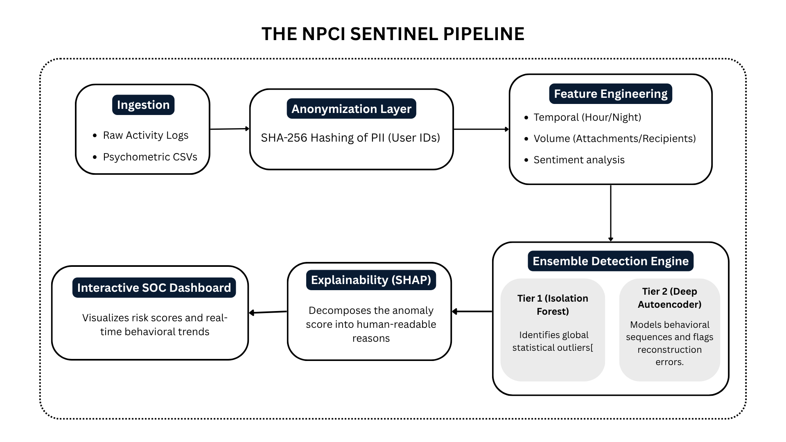

# 🛡️ NPCI Sentinel: AI-Powered Insider Threat Detection

**Developed by:** Vaibhav Chauhan (JK Lakshmipat University)  
**Event:** Techkriti'26 | NPCI CyberSecurity Hackathon  

## 📌 Project Overview
NPCI Sentinel is a professional-grade Insider Threat Detection System designed to identify anomalous behavior within an organization using a hybrid AI approach. Unlike standard security tools, Sentinel correlates **System Logs** with **Psychometric Profiles (OCEAN)** to detect both intentional and unintentional security risks.

## 🏗️ System Architecture

## 🚀 Key Features
- **Two-Tier Detection Engine:** Combines Isolation Forests (Unsupervised ML) with Deep Autoencoders (Deep Learning) for maximum precision[cite: 53, 56].
- **Explainable AI (XAI):** Integrated **SHAP** values to provide human-readable reasons for every flagged anomaly.
- **Privacy-First Design:** Full SHA-256 hashing of sensitive fields and AES-256 encryption logic.
- **Interactive SOC Dashboard:** A Streamlit-based interface for security teams to monitor fleet risk and adjust detection sensitivity in real-time.

## 🛠️ Tech Stack
- **Language:** Python 3.10+
- **ML/AI:** Scikit-Learn, PyTorch, SHAP
- **Data Engineering:** Pandas, NumPy
- **Dashboard:** Streamlit, Plotly
- **Security:** Cryptography (SHA-256)

## 🛰️ Real-Time Scalability (Kafka Integration)
To meet the requirements for **System Scalability**[cite: 36, 37], NPCI Sentinel includes a modular **Kafka-ready Ingestion Wrapper**. 
- **Live Streaming:** The architecture supports direct connection to Kafka brokers for real-time log ingestion[cite: 61].
- **High Throughput:** Designed to process thousands of events per second by decoupling the Ingestion Layer from the Detection Engine.
- **Microservices Ready:** The `src/ingestion.py` module allows Sentinel to function as a standalone security node within a larger SOC ecosystem.

## ⚙️ Installation & Setup
1. **Clone the Repo:** `git clone <your-repo-link>`
2. **Environment:** `python -m venv env` and `source env/bin/activate`
3. **Dependencies:** `pip install -r requirements.txt`
4. **Run Pipeline:** `python main_pipeline.py` (To process logs and train models)
5. **Launch Dashboard:** `streamlit run app/main.py`

**Credentials:** Admin ID: `admin` | Access Key: `npci2026`